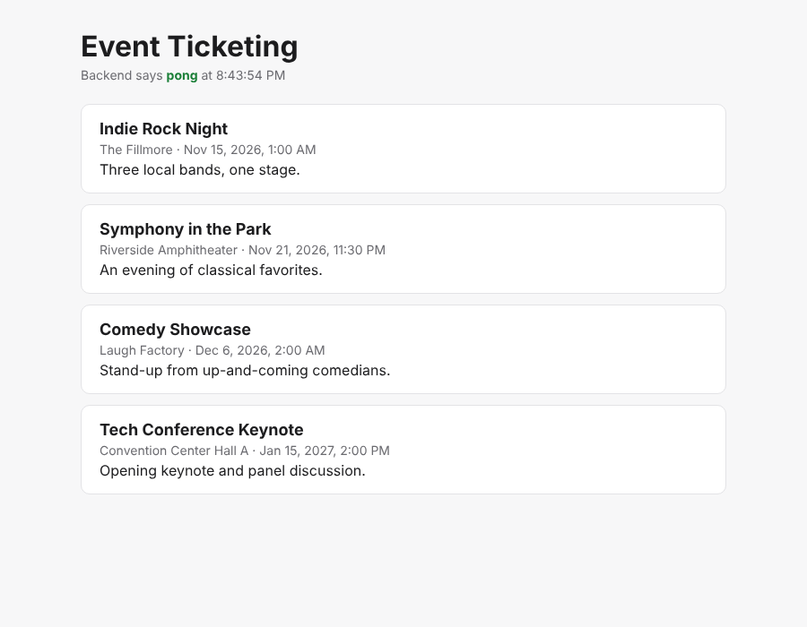

# Event Ticketing

A full-stack event ticketing app: browse events, pick seats on a live seat map, and check out without ever selling the same seat twice.

**Stack:** React + TypeScript · Java 21 + Spring Boot 4 · PostgreSQL · Docker · GitHub Actions



> **Status:** Project skeleton. The frontend talks to the backend, and the backend reads events from Postgres. Seat maps, holds, and booking come next (see [Roadmap](#roadmap)).

---

## How the pieces fit together

```
┌──────────────────────┐   HTTP + JSON    ┌──────────────────────┐    SQL     ┌──────────────┐
│  React frontend      │ ───────────────► │  Spring Boot backend │ ─────────► │  PostgreSQL  │
│  (runs in browser)   │ ◄─────────────── │  (Java REST API)     │ ◄───────── │  (database)  │
│  localhost:5173      │                  │  localhost:8080      │            │  :5432       │
└──────────────────────┘                  └──────────────────────┘            └──────────────┘
```

- **Frontend (React):** everything the user sees. It never touches the database. It asks the backend for data by calling URLs like `GET /api/events`.
- **Backend (Spring Boot):** the "brain." It receives HTTP requests, applies business rules (e.g. "this seat is already held"), reads and writes the database, and returns JSON.
- **Database (Postgres):** stores everything permanently: events, seats, bookings, users.

During development, the Vite dev server **proxies** any request starting with `/api` to `localhost:8080`. The browser thinks it's all one site, so no CORS setup is needed.

### The life of one request

When you open the page:

1. `EventList.tsx` calls `useEvents()`, which fetches `/api/events`.
2. Vite forwards it to Spring Boot on port 8080.
3. `EventController` receives it and calls `EventService.findAll()`.
4. `EventService` asks `EventRepository` for the events. Spring Data generates the SQL.
5. Hibernate runs `SELECT ... FROM events ORDER BY starts_at` against Postgres.
6. Rows become `Event` entities, then `EventResponse` records, then JSON.
7. React Query caches the JSON, and React renders the event cards.

---

## Project structure

```
event-ticketing/
├── backend/                     Java / Spring Boot REST API
│   ├── pom.xml                  Maven build file: dependencies and plugins
│   ├── mvnw                     Maven wrapper: no need to install Maven yourself
│   └── src/
│       ├── main/java/com/eventticketing/
│       │   ├── BackendApplication.java   Entry point (main method)
│       │   ├── health/
│       │   │   └── PingController.java   GET /api/ping, a connectivity check
│       │   └── event/                    Everything about events lives together
│       │       ├── Event.java              JPA entity: maps to the "events" table
│       │       ├── EventRepository.java    Database queries (Spring Data JPA)
│       │       ├── EventService.java       Business logic + transactions
│       │       ├── EventController.java    HTTP endpoints (/api/events)
│       │       ├── EventResponse.java      JSON shape sent to the frontend (DTO)
│       │       └── EventNotFoundException.java  Becomes HTTP 404
│       ├── main/resources/
│       │   ├── application.yml           Config: DB connection, port, etc.
│       │   └── db/migration/             Flyway SQL migrations (schema history)
│       │       ├── V1__create_events.sql
│       │       └── V2__seed_events.sql
│       └── test/java/com/eventticketing/
│           ├── TestcontainersConfiguration.java  Spins up real Postgres for tests
│           └── EventApiIntegrationTest.java      End-to-end API tests
│
├── frontend/                    React + TypeScript (Vite)
│   ├── package.json             npm dependencies and scripts
│   ├── vite.config.ts           Dev server + /api proxy to the backend
│   └── src/
│       ├── main.tsx             Entry point: mounts React, sets up React Query
│       ├── App.tsx              Top-level page layout
│       ├── index.css            Styles (light + dark mode)
│       ├── api/
│       │   ├── client.ts        fetch wrapper: all HTTP calls go through here
│       │   └── events.ts        TypeScript types + React Query hooks
│       └── components/
│           ├── BackendStatus.tsx   Shows whether the backend is reachable
│           └── EventList.tsx       Renders the list of events
│
├── docker-compose.yml           Runs Postgres locally in Docker
├── .github/workflows/ci.yml     GitHub Actions: tests + build on every push
└── docs/                        Screenshots, diagrams
```

### Backend layers, and why they're separate

| Layer | Class | Responsibility |
|---|---|---|
| **Controller** | `EventController` | HTTP only: URLs, status codes, request/response. No business logic. |
| **Service** | `EventService` | Business rules and transactions. Seat-hold logic will live here. |
| **Repository** | `EventRepository` | Talks to the database. Spring writes the implementation for you. |
| **Entity** | `Event` | A Java object that mirrors a database row. |
| **DTO** | `EventResponse` | What the API returns. Kept separate so DB changes don't break the frontend. |

Code is organized **by feature** (`event/`, later `booking/`, `seat/`, `user/`) rather than by layer (`controllers/`, `services/`). Related code stays together as the app grows.

### Key technologies

| Tech | What it does here |
|---|---|
| **Spring Boot** | Runs the web server, wires classes together (dependency injection), handles config. |
| **Spring Data JPA / Hibernate** | Maps Java objects to tables and generates SQL. |
| **Flyway** | Applies `db/migration/V*.sql` files in order, once each. The database schema is version-controlled like code. Never edit a migration that has already run; add a new `V3__...sql` instead. |
| **Testcontainers** | Tests run against a real Postgres in Docker, not a fake in-memory DB. |
| **Vite** | Fast dev server with hot reload, plus the production build tool. |
| **React Query** | Fetches, caches, and tracks loading/error state for server data. |
| **Docker Compose** | One command to run Postgres locally with the right settings. |

---

## Setup on a Mac

### 1. Install the tools (one time)

Install [Homebrew](https://brew.sh) if you don't have it, then:

```bash
brew install openjdk@21 node@22 git
brew install --cask docker            # Docker Desktop. Open it once after installing.
```

Make Java 21 the default (Homebrew prints this command after install):

```bash
sudo ln -sfn $(brew --prefix)/opt/openjdk@21/libexec/openjdk.jdk /Library/Java/JavaVirtualMachines/openjdk-21.jdk
```

Check everything:

```bash
java -version    # should say 21
node -v          # should say v22.x
docker -v
```

**Recommended editors:** IntelliJ IDEA Community (backend) and VS Code (frontend). IntelliJ can open the whole repo too.

### 2. Clone the repo

```bash
git clone https://github.com/<your-username>/<repo-name>.git
cd <repo-name>
```

### 3. Run it (three terminals)

**Terminal 1: database**
```bash
docker compose up -d          # starts Postgres in the background
```

**Terminal 2: backend**
```bash
cd backend
./mvnw spring-boot:run        # first run downloads dependencies, so give it a minute
```
Flyway creates the tables and seed data automatically on startup.
Check it: http://localhost:8080/api/events

**Terminal 3: frontend**
```bash
cd frontend
npm install                   # first time only
npm run dev
```
Open http://localhost:5173. You should see "Backend says **pong**" and the event list.

### Stopping things

- Backend / frontend: `Ctrl+C` in their terminals
- Database: `docker compose down` (data is kept in a Docker volume)
- Wipe the database completely: `docker compose down -v`

### Working at the library (or anywhere offline-ish)

- Run `./mvnw spring-boot:run` and `npm install` once at home. After that, dependencies are cached, so you can work without downloading anything.
- Docker Desktop must be running for the database and the backend tests.
- Commit and push often: `git add -A && git commit -m "..." && git push`.

---

## Common commands

| Task | Command |
|---|---|
| Run backend tests (needs Docker) | `cd backend && ./mvnw test` |
| Build backend jar | `cd backend && ./mvnw package` |
| Frontend dev server | `cd frontend && npm run dev` |
| Frontend production build | `cd frontend && npm run build` |
| Lint frontend | `cd frontend && npm run lint` |
| Connect to the database | `docker exec -it ticketing-postgres psql -U ticketing` |

## API

| Method | Path | Description |
|---|---|---|
| GET | `/api/ping` | Health check, returns `{ "message": "pong" }` |
| GET | `/api/events` | All events, soonest first |
| GET | `/api/events/{id}` | One event, or 404 |
| GET | `/actuator/health` | Spring Boot health (includes DB status) |

---

## Roadmap

Each step adds something worth talking about in an interview.

- [x] **Skeleton:** React ↔ Spring Boot ↔ Postgres, Flyway, Testcontainers, CI
- [ ] **Seats:** `venues`, `seats`, and `event_seats` tables; seat map UI
- [ ] **Seat holds:** hold a seat for 10 minutes. **Concurrency is the core challenge:** two users clicking the same seat at the same moment. Compare optimistic locking (`@Version`) and pessimistic locking (`SELECT ... FOR UPDATE`), and prove it with a concurrent test.
- [ ] **Expiring holds:** a `@Scheduled` job releases holds that were never purchased
- [ ] **Auth:** sign up / log in with Spring Security + JWT; users see their own bookings
- [ ] **Checkout:** convert holds into a booking (mock payment)
- [ ] **Live updates:** WebSockets so the seat map updates for everyone in real time
- [ ] **Admin:** create events and venues, view sales
- [ ] **Deploy:** frontend on Vercel/Netlify, backend + Postgres on Render/Fly.io
- [ ] **Polish:** Tailwind styling, React Router, Playwright end-to-end tests, architecture diagram
